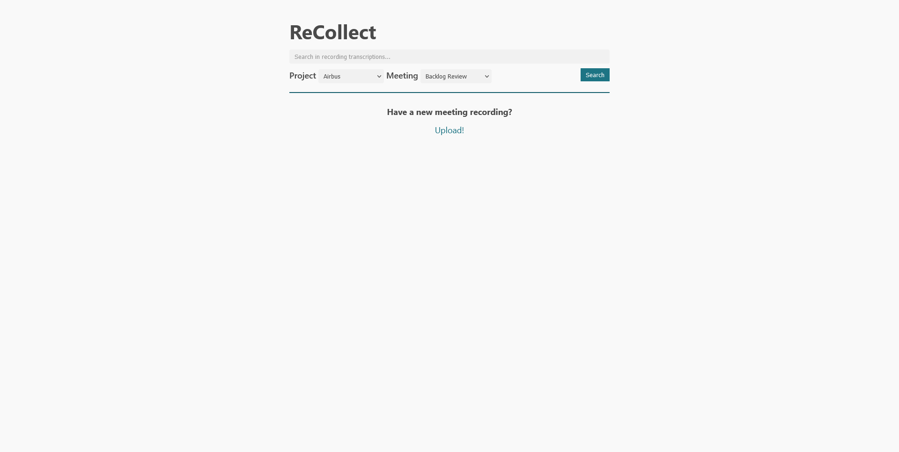
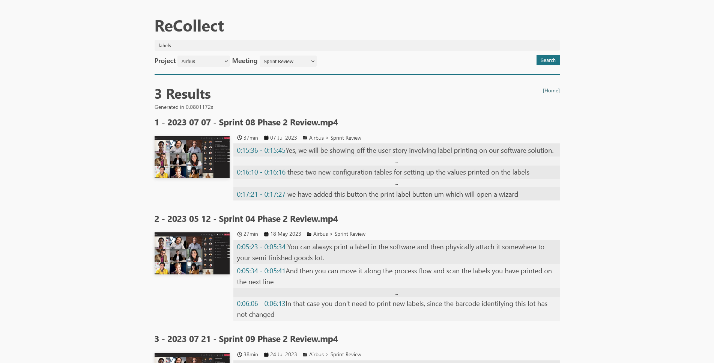

# ReCollect
Web-server application to index, transcribe and search video recordings. Useful for locating information discussed in past meetings.
Developed as a learning project.

## Screenshots

## Tech Stack
 - Java
 - Spring Boot
 - JPA, Hibernate & H2
 - Mustache templates
 - FFMPEG (information about media files and generate thumbnails)
 - Whisper AI (transcribe recordings)

## How it works

## To-Do list
 - [x] Home page
 - [x] Search results page
 - [ ] Recording details page
 - [ ] Upload page
 - [ ] Integrate with an external Full-Text-Search engine (Elastic Search, SQLite, etc...) for better search results
 - [ ] Transcribe new recordings automatically using WhisperAI command line tool